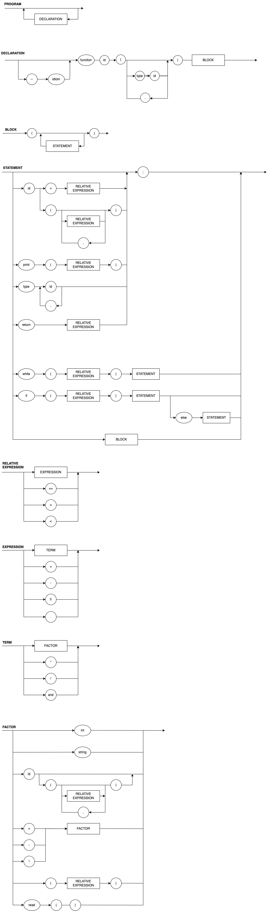

# Wthon
Wthon is a global language. This project will implement thre different idioms: English, German and Portuguese.

# Example

```py

--portugues;
funcao OlaMundo(int n){
    int x;
    x = 0;
    enquanto (x < n){
        imprime("Ola Mundo: ");
        imprime(x);
        x = x + 1;
    }
}

--deutsch;
funktion HalloWelt(int n){
    int x;
    x = 0;
    solange ((x < n)){
        drucken("Hallo Welt: ");
        drucken(x);
        x = x + 1;
    }
}

--english;
function HelloWorld(int n){
    int x;
    x = 0;
    while (x < n){
        print("Hello World: ");
        print(x);
        x = x + 1;
    }
}

--portugues;
funcao Principal(){
    HelloWorld(1);
    OlaMundo(1);
    HalloWelt(1);
}
```
## EBNF

```TXT
PROGRAM = { DECLARATION }
DECLARATION = (λ | IDIOM_SELECTOR), ("function"|"funcao"| "funktion"), IDENTIFIER,  "(" , FUNCVARDEC , ")" , BLOCK;
IDIOM_SELECTOR = "--", ("english"| "portugues"| "deutsch")
FUNCVARDEC = TYPE, IDENTIFIER, [{"," , TYPE, IDENTIFIER}];
   
BLOCK = "{", { STATEMENT }, "}";

STATEMENT = ( λ | ASSIGMENT | FUNCALL | PRINT | VARDEC | RETURN | WHILE | IF | BLOCK);
FUNCALL = IDENTIFIER , "(" , RELATIVE_EXPRESSION , [{"," , RELATIVE_EXPRESSION}] , ")", ";" ;
ASSIGMENT = IDENTIFIER, "=", RELATIVE_EXPRESSION, ";";
PRINT = ("print | "imprime" | "drucken"), "(", RELATIVE_EXPRESSION, ")", ";";
VARDEC = TYPE, IDENTIFIER, [{"," , IDENTIFIER}], ";";
RETURN = ("return"|"retorna"|"gibzurueck"), ";";
WHILE = ( "while" | "enquanto" | "solange" ) , "(", RELATIVE_EXPRESSION , ")" , STATEMENT ;
IF = ( "if" | "se" | "wenn" ) , "(", RELATIVE_EXPRESSION , ")" , STATEMENT , [( "else" | "senao" | "sonst" ) , STATEMENT ] ;
TYPE = ("int, str");

RELATIVE_EXPRESSION = EXPRESSION, { ( "==" | "<" | ">" ), EXPRESSION}; 
EXPRESSION = TERM, { ("+" | "-" | ("or" | "ou" | "oder") ), TERM}; 
TERM = FACTOR, { ("*" | "/" | ("and" | "e" | "und")), FACTOR};
FACTOR = (("+" | "-" | ("not"| "nao" | "nicht")), FACTOR) | NUMBER | STRING | "(", RELATIVE_EXPRESSION, ")" | IDENTIFIER | (IDENTIFIER, "(", [{RELATIVE_EXPRESSION, ","}], ")" );
NUMBER = DIGIT, { DIGIT };
DIGIT = ( 1 | 2 | 3 | 4 | 5 | 6 | 7 | 8 | 9 | 0) ;
STRING = LETTER, 
IDENTIFIER = LETTER, { LETTER | DIGIT | "_"} ; 
LETTER = ( a | ... | z | A | ... | Z) ;
IDIOM = ("portugues" | "english" | "deutsch" ) ;


```


# DIAGRAMA SINTÁTICO

